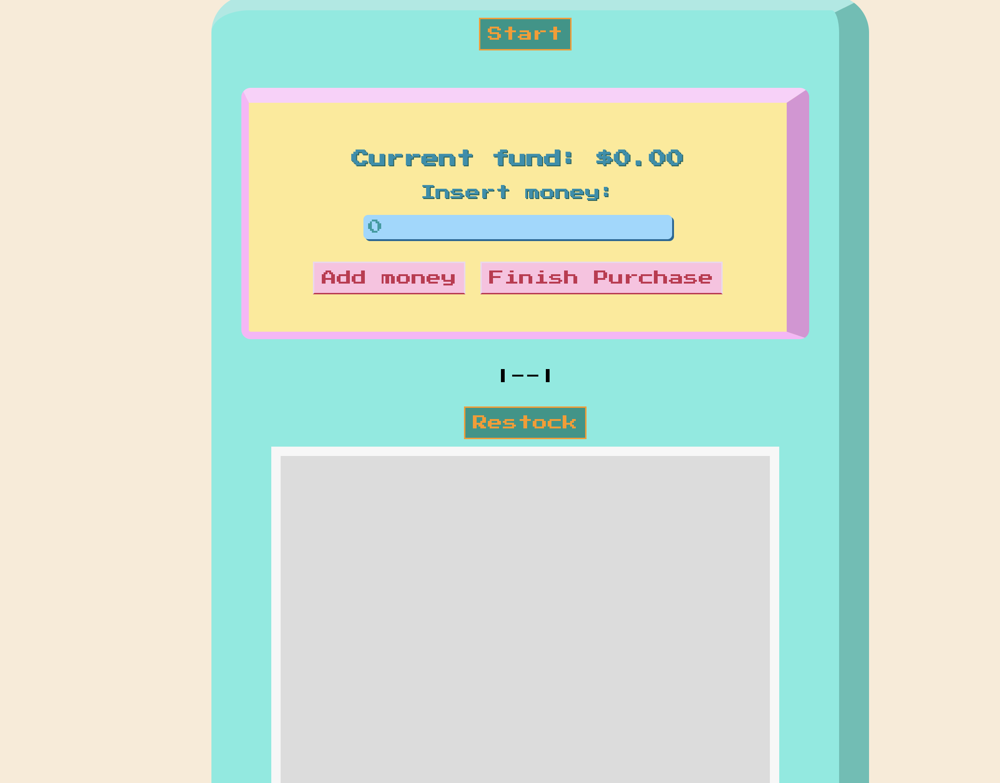
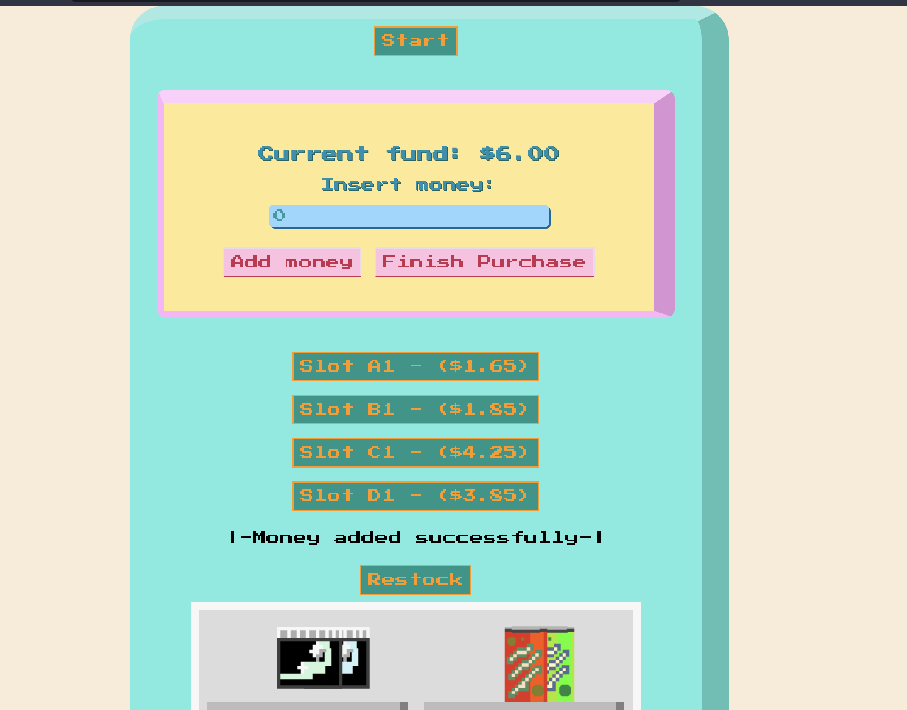
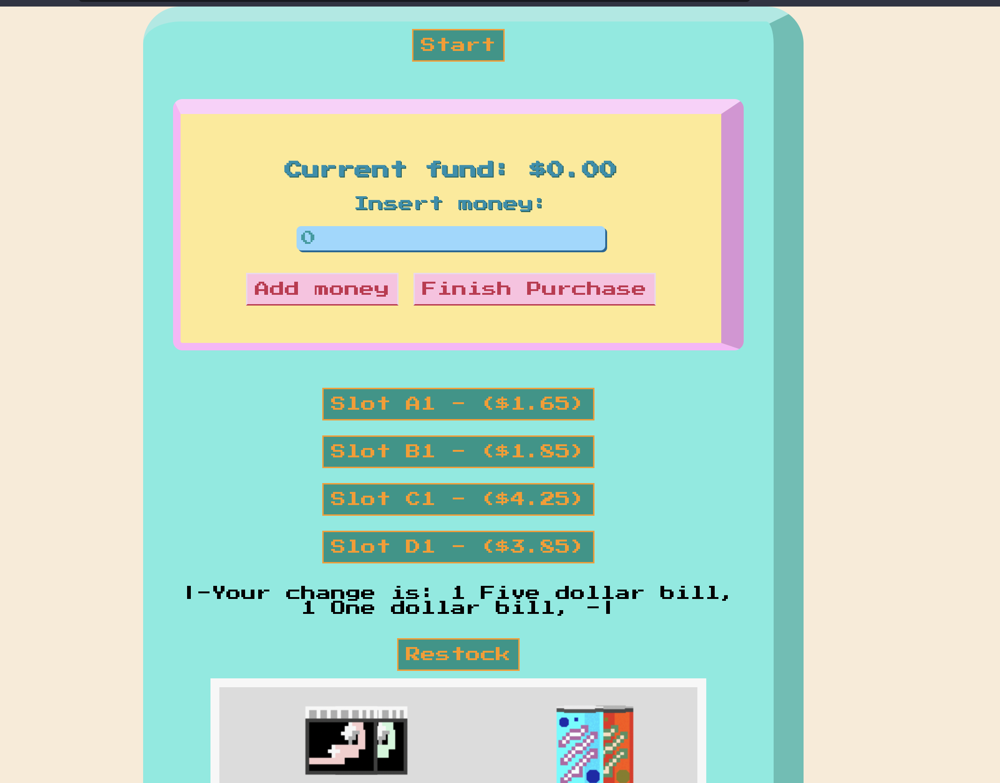

# =================================
# Project: Vending Machine App Revamp
# Description:
The Vending Machine App is a simple application built using the Spring Boot framework that simulates the behavior of a vending machine. The app allows users to select a product and make a payment in order to receive their desired item. The project also includes a basic frontend interface that displays the available products, accepts user input, and handles the transaction flow. The inventory is obtained via csv file in src/main/resources.
 
This application is an overhaul of a previous project that consisted of reading and writing files with a similar vending machine but now with a web-based UI. Previous Project: https://github.com/ZhangKevin-hub/VendingMachineTechElevator
# Installation:
To install and run the application, follow these steps:

Clone the repository from GitHub
Open the project in an IDE (e.g. IntelliJ, Eclipse)
Ensure that you have Java 11 installed on your machine
Run the application using the Spring Boot plugin or build a JAR file using Maven and run it from the command line
Usage:
Once the application is running, you can access it by visiting your web browser. This will display the main page of the vending machine app, which allows you to select a product and make a payment.

# Contributing:
If you'd like to contribute to the project, please fork the repository and create a new branch for your changes. Once you've made your changes, submit a pull request and we'll review it as soon as possible.
